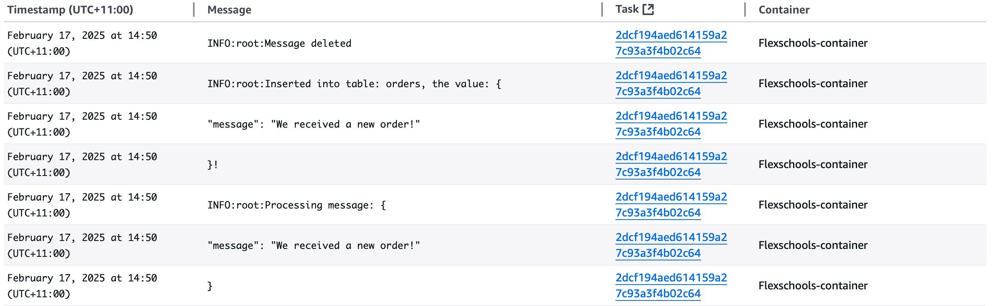

# Part 1: Infrastructure as Code (CDK)

# Flexischools Order Processing Application

This project demonstrates how to build and deploy a Fargate service using Python 3.13
that receives messages from an SQS queue representing orders that need to be processed and then stored in an RDS Database.

# Requirements

1. Create an AWS account if you do not already have one.
   1. The IAM user that you use must have sufficient permissions to make necessary AWS service calls and manage AWS resources.
2. [AWS CLI](https://docs.aws.amazon.com/cli/latest/userguide/getting-started-install.html) installed and configured with the default region you wish to deploy the stack to.
3. [Git](https://git-scm.com/book/en/v2/Getting-Started-Installing-Git) installed
4. [AWS CDK bootstrapping](https://docs.aws.amazon.com/cdk/v2/guide/bootstrapping-env.html) to prepare the AWS account for CDK deployments.
5. [Docker](https://docs.docker.com/engine/install/) installed
6. [Python 3.13](https://www.python.org/downloads/) installed
7. [Python Poetry](https://python-poetry.org) installed

# Deployment Instructions

1. Create a new directory, navigate to that directory in a terminal and clone the GitHub repository:

   ```bash
   git clone https://github.com/nabil-zakaria/flexischools-order-processing.git
   ```

2. If you're using Docker Desktop for the Mac you will need to disable containerd from Settings -> General in Docker Desktop
**This is because there's currently a [bug with building images from Assets and publishing to ECR](https://github.com/aws/aws-cdk/issues/33264)**

3. On the command line, execute the following commands to deploy the stack using CDK:

   ```bash
   cd flexischools-order-processing
   python3 -m venv .venv
   source .venv/bin/activate
   pip install poetry
   poetry install
   poetry export --without-hashes --only prod -f requirements.txt > requirements.txt
   cdk synth
   cdk deploy
   ```

# Testing

## Unit Testing

1. To execute unit tests

   ```bash
   python -m pytest
   ```

## Application Testing

1. Navigate to the SQS Console

2. Find the SQS queue named: `Flexischools-orders-queue`
   

3. Press `Send and Receive message` button

4. Enter the below message into `Message Body` field:
   

   ```JSON
   {
      "message": "We received a new order!"
   }
   ```

5. Press `Send message`

6. Open ECS console

7. Find cluster with name `Flexischools-cluster`

   

8. Find service whose name starts with `Flexischools-service`
   

9. View the logs for an active task and you'll see the messages where the orders are being processed
   

# Cleanup

To delete the stack execute:

   ```bash
   cdk destroy
   ```
